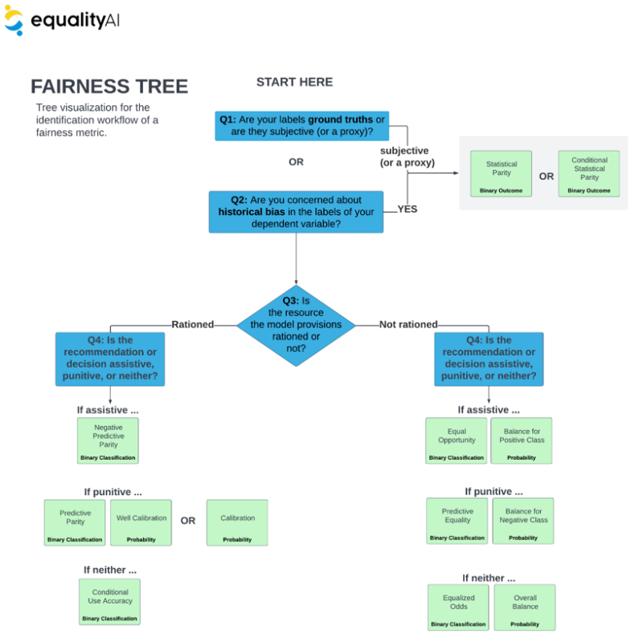

# Equality AI `FairML`

### Let's end algorithmic bias together!

[Equality AI (EAI)](https://equalityai.com/) is a public-benefit corporation dedicated to providing developers with evidence-based tools to end algorithmic bias. Our tools are built by developers for developers. So, we know that developers want their models to be fair, but we also understand that bias is <b> difficult and intimidating.</b> 

The EAI `FairML` repository provides functions and guidance on how to include fairness and bias mitigation methods to model fitting so as to safeguard the people on the receiving end of our models from bias. 

If you like what we're doing, give us a :star: and join our [EAI Manifesto!](https://equalityai.com/community/#manifesto)!</br>
<br></br>


>We have extented `FairML` to include other aspects of Responsible AI (see full framework <b>Figure 1.</b>) and collaboration features to create our Beta MLOps Developer Studio. <b>Become a Beta user by going to our [website!](https://equalityai.com/)</b>

<center>

<sub><b>Figure 1:</b> Full Responsible AI Framework.
</sub>
  </center>


## Introduction
Incorporating bias mitigation methods and fairness metrics into the traditional end-to-end MLOps is called fairness-based machine learning (ML) or fair machine learning. However, Fairness-based ML comes with its own challenges. We assembled a diverse team of statisticians and ML experts to provide a workflow or series of steps, evidence-based guidance on fairness metrics, and validated code to properly run bias mitigation methods.

### Fairness Metric:
* Statistical measure of the output of a machine learning model based a mathematical definition of fairness.

> [Fairness Metric Guide:](https://github.com/EqualityAI/FairML/blob/main/Fairness%20Metrics%20User%20Manual.pdf)
<sub>We have combined fairness metrics and bias mitigation into a unified syntax.</sub><br></br><sub> Statistical Parity | Conditional Statistical Parity | Negative Predictive Parity | Equal Opportunity | Balance for Positive Class | Predictive Parity | Well Calibration | Calibration | Conditional Use Accuracy | Predictive Equality | Balance for Negative Class | Equalized Odds | Overall Balance
  > We have combined fairness metrics and bias mitigation into a unified syntax.
>> 
</sub>


### Bias Mitigation:
* Methods or algorithms applied to a machine learning dataset or model to improve the fairness of the model output. Many mitigation methods have been proposed in the literature, which can be broadly classified into the application of a mitigation method on the data set (pre-processing), in the model fitting (in-processing), and to the model predictions (post-processing).

> [Bias Mitigation Guide:](https://github.com/EqualityAI/FairML/blob/main/Fairness%20Metrics%20User%20Manual.pdf)
<sub> Resampling | Reweighting | Disparate Impact Remover | Correlation Remover 
</sub>


<sub><b>Figure 2:</b> Bias mitigation can be performed in the pre-processing, in-processing, and post-processing of a model.
</sub>
<br></br>

Bias mitigation methods are employed to address bias in data and/or machine learning models and fairness metrics are needed to mathematically represent the fairness or bias levels of a ML model.

### Fair ML Workflow:
<left>
  
| Step                                                         | Description          |
| ------------------------------------------------------------ |:-------------------------------------------------|
| Determine potential bias                                     | Determine potential sources of bias also known as (a.k.a) sources of harm.   |
| Select fairness metric                                       | Quanitfy a measure of fairness (a.k.a a fairness metric) targeting that bias |
| Evaluate fairness                                            | Fairness metrics can be used to mathematically represent the fairness levels of a ML model. |
| Create parity on fairness                                    | Unlike model performance metrics (e.g., loss, accuracy, etc.), fairness metrics affect your final model selection by creating parity (i.e., equality) on appropriate fairness metrics before model deployment. |
| Select most fair model                                       | Balance fairness with performance metrics when selecting the final model.|
| Apply methods to improve the fairness & performance tradeoff | Methods to improve the fairness by applying a.k.a bias mitigation methods |

</left>

Through these steps we <b>safeguard against bias</b> by:
> 1. Creating metrics targeting sources of bias to balance alongside our performance metrics in evaluation, model selection, and monitoring.
> 2. Applying bias mitigation methods to improve fairness without compromising performance.


## How to use FairML in model fitting
Fairness can be integrated into the model fitting process through creating parity (i.e., equality) on appropriate fairness metrics before model deployment, then tracking those metrics throughout deployment with model performance metrics (e.g., loss, accuracy, etc.).

<b>Note:</b> Parity is achieved when a fairness metric (such as the percent of positive predictions) have the same value across all levels of a sensitive attribute.  <i>Sensitive attributes</i> are attributes such as race, gender, age, and other patient attributes that are of primary concern when it comes to fairness, and are typically protected by law. 

</br>
<sub><b>Figure 2:</b> An infographic showing where to incorporate fairness evaluation and bias mitigation.
</sub></br>

>1. The first row of Figure 2. displays the workflow for traditional ML: data fetch, data prepare, train ML model, performance validation.

We recommend integrating FairML by:

>2. Evaluating the fairness of your machine learning model fit in Step 1.
>3. Running bias mitigation, which can be done in a pre-processing, in processing, or post processing workflow.
> <i> In processing and Post processing will be available in future iterations.</i>
>4. Reevaluating the fairness after mitigation
>5. Comparing model performance and fairness before and after mitigation </br></br>

## Guidance on selecting Fairness Metrics
To make fairness metric selection easy we have provided a few essential questions you must answer to identify the appropriate fairness metric for your use case. Here is our extensive literature review and [theoretical analysis](https://github.com/EqualityAI/FairML/blob/main/Fairness%20Metrics%20User%20Manual.pdf) on dozens of fairness metrics and mitigation methods. [Click here for the questionnaire](https://github.com/EqualityAI/FairML/blob/main/Equality%20AI%20Fairness%20Metric%20Selection%20Questionnaire%20%26%20Tree.pdf). Complete the answers to this questionnaire, then refer to the scoring guide to map your inputs to the desired metrics.

</br>
<sub><b>Figure 3:</b> Tree representation of questionnaire.
</sub></br>

After identifying the important fairness criteria, we recommend you attempt to use multiple bias mitigation strategies to try to optimize the efficiency-fairness tradeoff.</br>

## Installation

FairML can be installed from [PyPI](https://pypi.org/project/fairml/).

```bash
pip install fairml
```

## Quick tour

Check out the example below to see how FairML can be used to evaluate the fairness of a Ml model and dataset.

```python
from sklearn.linear_model import LogisticRegression
from fairml import FairnessMetric

# Train a machine learning model (for example LogisticRegression)
ml_model = LogisticRegression()
ml_model.fit(X_train, Y_train)

fairness_metric = FairnessMetric(ml_model=ml_model, data=testing_data,
                                 target_variable="Y",
                                 protected_variable="X1", privileged_class=1)
metric_name='statistical_parity_ratio'
fairness_metric_score = fairness_metric.fairness_score(metric_name)
```

In case the model is unfair in terms of checked fairness metric score, FairML provides a range of methods to try to
mitigate bias in Machine Learning models. For example, we can use 'correlation-remover' to perform mitigation on 
training dataset.

```python
from sklearn.linear_model import LogisticRegression
from fairml import BiasMitigation

# Train a machine learning model (for example LogisticRegression)
ml_model = LogisticRegression()
ml_model.fit(X_train, Y_train)

mitigation_method = "correlation-remover"
bias_mitigation = BiasMitigation(ml_model=ml_model, data=train_data,
                                 target_variable="Y",
                                 protected_variable="X1", privileged_class=1)

mitigation_res = bias_mitigation.fit_transform(mitigation_method=mitigation_method)
```

## Development setup

Describe how to install all development dependencies and how to run an automated test-suite of some kind.

```sh
pip install -e '.[all, tests]'
pytest tests
```

## Release History

* 0.0.1
    * Work in progress

## Responsible AI Takes a Community
The connections and trade-offs between fairness, explainability, and privacy require a holistic approach to Responsible AI development in the machine learning community. We are starting with the principle of fairness and working towards a solution that incorporates multiple aspects of Responsible AI for data scientists and healthcare professionals. We have much more in the works, and we want to know—what do you need? Do you have a Responsible AI challenge you need to solve? [Drop us a line and let’s see how we can help!](https://equalityai.slack.com/join/shared_invite/zt-1claqpebo-MnGnGoqCM9Do~40HqbSaww#/shared-invite/email)


## Contributing to the project
Equality AI uses both GitHib and Slack to manage our open source community. To participate:

1. Join the Slack community (https://equalityai.com/slack)
    + Introduce yourself in the #Introductions channel. We're all friendly people!
2. Check out the [CONTRIBUTING](https://github.com/EqualityAI/FairML/blob/main/CONTRIBUTING.md) file to learn how to contribute to our project, report bugs, or make feature requests.
3. Try out the [`FairML`](https://github.com/EqualityAI/FairML)
    + Hit the top right "star" button on GitHub to show your love!
    + Follow the recipe above to use the code. 
4. Provide feedback on your experience using the [GitHub discussions](https://github.com/EqualityAI/FairML/discussions) or the [Slack #support](https://equalityai.slack.com/archives/C03HF7G4N0Y) channel
    + For any questions or problems, send a message on Slack, or send an email to support@equalityai.com.
