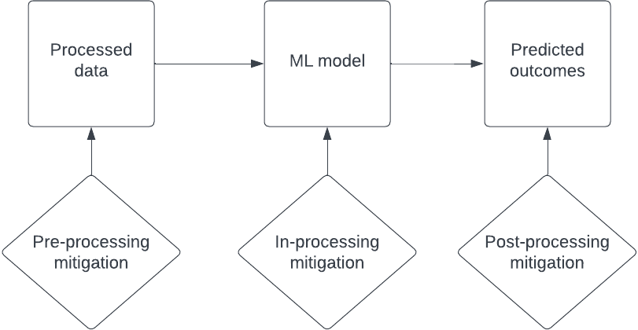
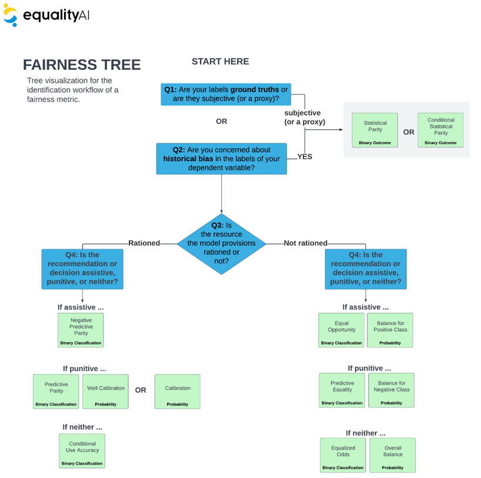

[](https://github.com/EqualityAI/EqualityML/actions/workflows/R-CMD-check.yaml)
[](https://github.com/EqualityAI/EqualityML/blob/main/LICENSE)
[](https://github.com/EqualityAI/EqualityML/blob/main/CODE_OF_CONDUCT.md)
<!---
[](http://aif360.readthedocs.io/en/latest/?badge=latest)
[](https://cran.r-project.org/package=equalityml)
--->
# Equality AI `EqualityML`

### Let's end algorithmic bias together! 

[Equality AI (EAI)](https://equalityai.com/) is a public-benefit corporation dedicated to providing developers with evidence-based tools to end algorithmic bias. Our tools are built by developers for developers. So, we know that developers want their models to be fair, but we also understand that bias is <b> difficult and intimidating.</b> 

The EAI `EqualityML` repository provides tools and guidance on how to include fairness and bias mitigation methods to model fitting so as to safeguard the people on the receiving end of our models from bias. 

If you like what we're doing, give us a :star: and join our [EAI Manifesto!](https://equalityai.com/community/#manifesto)!</br>
<br></br>


>We have extented `EqualityML` to include other aspects of Responsible AI (see full framework <b>Figure 1.</b>) and collaboration features to create our Beta MLOps Developer Studio. <b>Become a Beta user by going to our [website!](https://equalityai.com/)</b>

<center>

<sub><b>Figure 1:</b> Full Responsible AI Framework.</sub>
</center>

## Introduction
Incorporating bias mitigation methods and fairness metrics into the traditional end-to-end MLOps is called fairness-based machine learning (ML) or fair machine learning. However, fair ML comes with its own challenges. We assembled a diverse team of statisticians and ML experts to provide evidence-based guidance on fairness metrics use/selection and validated code to properly run bias mitigation methods.

<details>
  <summary> Click to read our findings: </summary>
  
#### Fairness Metric
* Statistical measure of the output of a machine learning model based a mathematical definition of fairness.

> [Fairness Metric Guide:](https://github.com/EqualityAI/EqualityML/blob/main/equalityml-r/Fairness%20Metrics%20User%20Manual.pdf)
We have combined fairness metrics and bias mitigation into a unified syntax.</br><sub> Statistical Parity | Conditional Statistical Parity | Negative Predictive Parity | Equal Opportunity | Balance for Positive Class | Predictive Parity | Well Calibration | Calibration | Conditional Use Accuracy | Predictive Equality | Balance for Negative Class | Equalized Odds | Overall Balance
</sub>

#### Bias Mitigation
* Methods or algorithms applied to a machine learning dataset or model to improve the fairness of the model output. Many mitigation methods have been proposed in the literature, which can be broadly classified into the application of a mitigation method on the data set (pre-processing), in the model fitting (in-processing), and to the model predictions (post-processing).

> [Bias Mitigation Guide:](https://github.com/EqualityAI/EqualityML/blob/main/Fairness%20Metrics%20User%20Manual.pdf)</br>
<sub> Resampling | Reweighting | Disparate Impact Remover | Correlation Remover 
</sub>


<sub><b>Figure 2:</b> Bias mitigation can be performed in the pre-processing, in-processing, and post-processing of a model.</sub>
<br>

> Need a specific metric or method? [Just let us know!](https://equalityai.slack.com/join/shared_invite/zt-1claqpebo-MnGnGoqCM9Do~40HqbSaww#/shared-invite/email)

#### Potential Uses

* Bias mitigation methods are employed to address bias in data and/or machine learning models and fairness metrics are needed to mathematically represent the fairness or bias levels of a ML model.
  
| Use                                                         | Description                                                                                                                                                                                                    |
|:-------------------------------------------------------------|:---------------------------------------------------------------------------------------------------------------------------------------------------------------------------------------------------------------|
| As a metric                                      | Quantify a measure of fairness (a.k.a a fairness metric) targeting a bias                                                                                                                                      |
| Evaluate fairness                                            | Fairness metrics can be used to mathematically represent the fairness levels of a ML model. This can also be used to monitor a model.                                                                          |
| Create parity on fairness                                    | Unlike model performance metrics (e.g., loss, accuracy, etc.), fairness metrics affect your final model selection by creating parity (i.e., equality) on appropriate fairness metrics before model deployment. |
| Select most fair model                                       | Balance fairness with performance metrics when selecting the final model.                                                                                                                                      |
| Apply methods to improve the fairness & performance tradeoff | Methods to improve the fairness by applying a.k.a bias mitigation methods                                                                                                                                      |

<sub><b>Table 1:</b> The potential uses for fairness metrics and bias mitigation methods.
</sub>

<b>Note:</b> Parity is achieved when a fairness metric (such as the percent of positive predictions) have the same value across all levels of a sensitive attribute.  <i>Sensitive attributes</i> are attributes such as race, gender, age, and other patient attributes that are of primary concern when it comes to fairness, and are typically protected by law. 
  <br></br>

Through these steps we <b>safeguard against bias</b> by:
> 1. Creating metrics targeting sources of bias to balance alongside our performance metrics in evaluation, model selection, and monitoring.
> 2. Applying bias mitigation methods to improve fairness without compromising performance.
 <br></br>
  
</details>


## EAI `EqualityML` Workflow
We have conducted extensive literature review and theoretical analysis on dozens of fairness metrics and mitigation methods. Theoretical properties of those fairness mitigation methods were analyzed to determine their suitability under various conditions to create our framework for a pre-processing workflow. 

| Pre-processing Workflow                                                  | Tool or Guidance provided                                                                                                                                                                                                               |
|:-------------------------------------------------------------------------|:----------------------------------------------------------------------------------------------------------------------------------------------------------------------------------------------------------------------------------------|
| 1. Select Fairness Metric                                                | Use our [Fairness Metric Selection Questionnaire & Tree](https://github.com/EqualityAI/EqualityML/blob/main/Equality%20AI%20Fairness%20Metric%20Selection%20Questionnaire%20%26%20Tree.pdf) to determine appropriate fairness metric(s) |
| 2. Data Preparation                                                      ||
| 3. Fit Prediction Model                                                  ||
| 4. Compute Model Results and Evaluate Fairness Metric                    | Use `EqualityML` function `fairness_metric` to evaluate the fairness of a model                                                                                                                                                         |
| 5. Run Bias Mitigation                                                   | Use `EqualityML` function `bias_mitigation` to run various bias mitigation methods on your dataset                                                                                                                                      |
| 6. Compute Model Results and Fairness Metric After Mitigation            | `fairness_metric` `bias_mitigation`                                                                                                                                                                                                     |
| 7. Compare Model Results and Fairness Metric Before and After Mitigation | `fairness_metric` `bias_mitigation`                                                                                                                                                                                                     |

<sub><b>Table 2:</b> The Equality AI recommended pre-processing workflow with tools and guidance made available per step.
</sub> </br>

We recommend assessing the fairness of the same ML model after bias mitigation is applied. By comparing the predictions before and after mitigation, we will be able to assess whether and to what extent the fairness can be improved. Furthermore, the trade-offs between the accuracy and fairness of the machine learning model will be examined.

> In-processing and Post-processing are still under development. Do you need this now? [Let us know!](https://equalityai.slack.com/join/shared_invite/zt-1claqpebo-MnGnGoqCM9Do~40HqbSaww#/shared-invite/email)

## Guidance on selecting Fairness Metrics
To make fairness metric selection easy we have provided a few essential questions you must answer to identify the appropriate fairness metric for your use case. [Click here for the questionnaire](https://github.com/EqualityAI/EqualityML/blob/main/equalityml-r/Equality%20AI%20Fairness%20Metric%20Selection%20Questionnaire%20%26%20Tree.pdf). Complete the answers to this questionnaire, then refer to the scoring guide to map your inputs to the desired metrics.

</br>
<sub><b>Figure 3:</b> Tree representation of questionnaire.</sub></br>

After identifying the important fairness criteria, we recommend you attempt to use multiple bias mitigation strategies to try to optimize the efficiency-fairness tradeoff.</br>

## Installation
The `EqualityML` R package can be installed from [CRAN](https://cran.r-project.org/web/packages/equalityml/index.html):
```
install.packages("equalityml")
```
or developer version from GitHub:
```
devtools::install_github("EqualityAI/equalityml/equalityml-r")
```

## Quick tour

Check out the example below to see how EqualityML can be used to evaluate the fairness of a Ml model and dataset.

```
library(fairmodels)
library(DALEX)
library(equalityml)
library(gbm)

df <- data.frame(
    sex = c(rep("M", 140), rep("F", 60)),
    age = c(rep(1:20,10)),
    target = c(
      c(rep(c(1, 1, 1, 1, 1, 1, 1, 0, 0, 0),14)),
      c(rep(c(0, 1, 0, 1, 0, 0, 1, 0, 0, 1),6))
    )
)
  
  
ml_model <- glm(target ~ sex + age, data = df, family = 'binomial')
  
fairness_score <- fairness_metric(ml_model = ml_model, input_data = df, 
                                target_variable = target_variable, 
                                protected_variable = protected_variable,
                                privileged_class = "M")
print(fairness_score)                              
```

In case the model is unfair in terms of checked fairness metric score, EqualityML provides a range of methods to try to
mitigate bias in Machine Learning models. For example, we can use 'resampling' to perform mitigation on 
training dataset.

```
library(fairmodels)
library(DALEX)
library(equalityml)

df <- data.frame(
    sex = c(rep("M", 140), rep("F", 60)),
    age = c(rep(1:20,10)),
    target = c(
      c(rep(c(1, 1, 1, 1, 1, 1, 1, 0, 0, 0),14)),
      c(rep(c(0, 1, 0, 1, 0, 0, 1, 0, 0, 1),6))
    )
)

target_variable = "target"
protected_variable = "sex"

# resampling
mitigation_method <- "resampling"
data_transformed <- bias_mitigation(mitigation_method, df, target_variable, protected_variable)
```

## Responsible AI Takes a Community
The connections and trade-offs between fairness, explainability, and privacy require a holistic approach to Responsible AI development in the machine learning community. We are starting with the principle of fairness and working towards a solution that incorporates multiple aspects of Responsible AI for data scientists and healthcare professionals. We have much more in the works, and we want to know—what do you need? Do you have a Responsible AI challenge you need to solve? [Drop us a line and let’s see how we can help!](https://equalityai.slack.com/join/shared_invite/zt-1claqpebo-MnGnGoqCM9Do~40HqbSaww#/shared-invite/email)


## Contributing to the project
Equality AI uses both GitHib and Slack to manage our open source community. To participate:

1. Join the Slack community (https://equalityai.com/slack)
    + Introduce yourself in the #Introductions channel. We're all friendly people!
2. Check out the [CONTRIBUTING](https://github.com/EqualityAI/EqualityML/blob/main/equalityml-r/CONTRIBUTING.md) file to learn how to contribute to our project, report bugs, or make feature requests.
3. Try out the [`EqualityML`](https://github.com/EqualityAI/EqualityML)
    + Hit the top right "star" button on GitHub to show your love!
    + Follow the recipe above to use the code. 
4. Provide feedback on your experience using the [GitHub discussions](https://github.com/EqualityAI/EqualityML/discussions) or the [Slack #support](https://equalityai.slack.com/archives/C03HF7G4N0Y) channel
    + For any questions or problems, send a message on Slack, or send an email to support@equalityai.com.