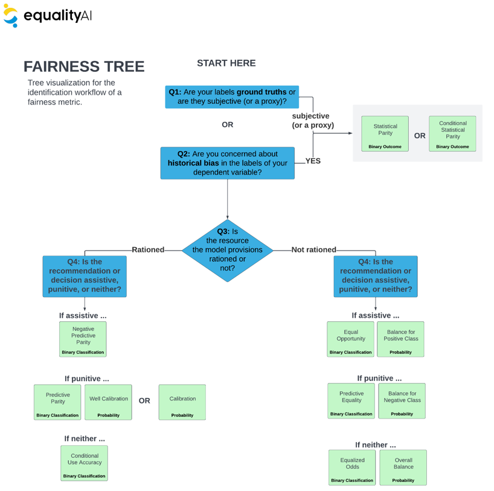

# Equality AI `FairML`

### Welcome to our GitHub repo!

[Equality AI (EAI)](https://equalityai.com/) is a public benefit corporation dedicated to providing developers with the tools to stop algorithmic bias. We believe that developers want to implement algorithmic fairness, but have encountered roadblocks along the way.</b>

`FairML` provides a set of tools to handle the fairness of a Machine Learning application or run Fairness-based machine learning (Fair ML). With the increased use of Machine Learning solutions on a variety of critical real-world problems, it is imperative to guarantee that fair decisions are performed by those black-box Machine Learning models. FairML aims to simplify the complex process of evaluating the fairness of ML models and provides a range of methods to mitigate bias in datasets.

If you like what we're doing, give us a :star: and join our [EAI Manifesto!](https://equalityai.com/community/#manifesto)!</br>
</br>

## How FairML is integrated with model fitting
Fairness can be integrated into the model fitting process through creating parity (i.e., equality) on appropriate fairness metrics before model deployment, then tracking those metrics throughout deployment with model performance metrics (e.g., loss, accuracy, etc.).

<b>Note:</b> Parity is achieved when a fairness metric (such as the percent of positive predictions) have the same value across all levels of a sensitive attribute.  <i>Sensitive attributes</i> are attributes such as race, gender, age, and other patient attributes that are of primary concern when it comes to fairness, and are typically protected by law. 

</br>
<sub><b>Figure 1:</b> An infographic showing where to incorporate fairness evaluation and bias mitigation.
</sub></br>

>1. The first row of Figure 1. displays the workflow for traditional ML: data fetch, data prepare, train ML model, performance validation.

We recommend integrating FairML by:

>2. Evaluating the fairness of your machine learning model fit in Step 1.
>3. Running bias mitigation, which can be done in a pre-processing, in processing, or post processing workflow.
>4. Reevaluating the fairness after mitigation
>5. Comparing model performance and fairness before and after mitigation </br></br>

## Guidance on selecting Fairness Metrics
To make fairness metric selection easy we have provided a few essential questions you must answer to identify the appropriate fairness metric for your use case. Here is our extensive literature review and [theoretical analysis](https://github.com/EqualityAI/FairML/blob/main/fairml-r/Fairness%20Metrics%20User%20Manual.pdf) on dozens of fairness metrics and mitigation methods. [Click here for the questionnaire](https://github.com/EqualityAI/FairML/blob/main/fairml-r/Equality%20AI%20Fairness%20Metric%20Selection%20Questionnaire%20%26%20Tree.pdf). Complete the answers to this questionnaire, then refer to the scoring guide to map your inputs to the desired metrics.

</br>
<sub><b>Figure 2:</b> Tree representation of questionnaire.
</sub></br>

After identifying the important fairness criteria, we recommend you attempt to use multiple bias mitigation strategies to try to optimize the efficiency-fairness tradeoff.</br>

## Installation
FairML can be installed from [CRAN](https://cran.r-project.org/web/packages/fairml/index.html):
```
install.packages("fairml")
```
or developer version from GitHub:
```
devtools::install_github("EqualityAI/fairml")
```

## Quick tour

Check out the example below to see how FairML can be used to evaluate the fairness of a Ml model and dataset.

```
library(fairmodels)
library(DALEX)
library(fairml)
library("gbm")

df <- data.frame(
    sex = c(rep("M", 140), rep("F", 60)),
    age = c(rep(1:20,10)),
    target = c(
      c(rep(c(1, 1, 1, 1, 1, 1, 1, 0, 0, 0),14)),
      c(rep(c(0, 1, 0, 1, 0, 0, 1, 0, 0, 1),6))
    )
)
  
  
ml_model <- glm(target ~ sex + age, data = df, family = 'binomial')
  
fairness_score <- fairness_metric(ml_model = ml_model, input_data = df, 
                                target_variable = target_variable, 
                                protected_variable = protected_variable,
                                privileged_class = "M",
                                ignore_protected = FALSE)
print(fairness_score)                              
```

In case the model is unfair in terms of checked fairness metric score, FairML provides a range of methods to try to
mitigate bias in Machine Learning models. For example, we can use 'resampling' to perform mitigation on 
training dataset.

```
library(fairmodels)
library(DALEX)
library(fairml)

df <- data.frame(
    sex = c(rep("M", 140), rep("F", 60)),
    age = c(rep(1:20,10)),
    target = c(
      c(rep(c(1, 1, 1, 1, 1, 1, 1, 0, 0, 0),14)),
      c(rep(c(0, 1, 0, 1, 0, 0, 1, 0, 0, 1),6))
    )
)

target_variable = "target"
protected_variable = "sex"

# resampling
mitigation_method <- "resampling"
data_transformed <- bias_mitigation(mitigation_method, df, target_variable, protected_variable)
```

## Release History

* 0.0.1
    * Work in progress

## Responsible AI Takes a Community
The connections and trade-offs between fairness, explainability, and privacy require a holistic approach to Responsible AI development in the machine learning community. We are starting with the principle of fairness and working towards a solution that incorporates multiple aspects of Responsible AI for data scientists and healthcare professionals. We have much more in the works, and we want to know—what do you need? Do you have a Responsible AI challenge you need to solve? [Drop us a line and let’s see how we can help!](https://equalityai.slack.com/join/shared_invite/zt-1claqpebo-MnGnGoqCM9Do~40HqbSaww#/shared-invite/email)


## Contributing to the project
Equality AI uses both GitHib and Slack to manage our open source community. To participate:

1. Join the Slack community (https://equalityai.com/slack)
    + Introduce yourself in the #Introductions channel. We're all friendly people!
2. Check out the [CONTRIBUTING](https://github.com/EqualityAI/FairML/blob/main/fairml-r/CONTRIBUTING.md) file to learn how to contribute to our project, report bugs, or make feature requests.
3. Try out the [`FairML`](https://github.com/EqualityAI/FairML)
    + Hit the top right "star" button on GitHub to show your love!
    + Follow the recipe above to use the code. 
4. Provide feedback on your experience using the [GitHub discussions](https://github.com/EqualityAI/FairML/discussions) or the [Slack #support](https://equalityai.slack.com/archives/C03HF7G4N0Y) channel
    + For any questions or problems, send a message on Slack, or send an email to support@equalityai.com.